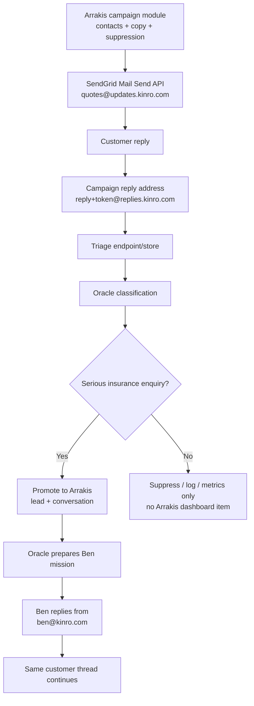

# Kinro Marketing Reply Triage and Arrakis Promotion Plan

Prepared: June 11, 2026  
Audience: Internal technical team  
Decision: Arrakis-owned campaign sending through SendGrid API, triage before Arrakis product surfaces, Oracle-qualified promotion, Ben same-thread execution

## 1. Executive Decision

Kinro should send marketing campaigns from a separate campaign identity, not from `ben@kinro.com`. Customers can reply directly to the campaign email if they want an insurance quote comparison or have questions. Those replies should first enter a campaign triage layer. Oracle classifies the reply, and only serious insurance enquiries are promoted into the Arrakis product surface.

The important boundary is:

> Non-serious campaign replies may be processed by backend triage for classification, compliance, suppression, and sender-health metrics, but they must not appear in the Arrakis dashboard, Ben workflow, or lead/conversation surface.

The recommended v1 stack is:

- **Arrakis campaign module** as the source of truth for imported recipients, campaign copy, send status, reply tokens, suppressions, Oracle triage, and qualified lead promotion.
- **SendGrid Mail Send API** as the delivery pipe for the first outbound campaign email. SendGrid should send the email, but it should not own the campaign brain or the lead truth.
- **SendGrid Event Webhook and Inbound Parse** for delivery events, bounces, unsubscribes/complaints, and customer replies.
- **Campaign triage layer** for reply ingestion, raw event handling, suppression, and Oracle classification.
- **Oracle** as the Arrakis brain that understands context, qualifies the reply, and prepares Ben's mission.
- **Arrakis** only for serious or manually approved potential leads.
- **Ben** as the execution identity, entering the same customer thread from `ben@kinro.com` only after Oracle qualifies the reply.
- **Smartlead** only as a fallback sender layer if SendGrid cannot safely support the required cold-outbound sender scale, warmup, inbox rotation, or subdomain routing.

## 2. Target Customer Flow

The customer experience should feel simple:

1. Kinro sends a compliant campaign email from a campaign address such as `quotes@updates.kinro.com`.
2. The email says something like: "Reply if you want an insurance quote comparison or have questions."
3. The customer replies directly to that email.
4. If the reply is serious, Ben joins the same email thread with context.
5. The customer does not see the internal filtering, Oracle classification, or Arrakis promotion steps.

Internally, the flow has a hard qualification gate before Arrakis:

## 3. Sending, Upload, and Domain Plan

Use a campaign identity that is separate from the primary Ben identity.

Recommended sender pattern:

- Campaign sender: `quotes@updates.kinro.com`
- Reply routing: `reply+<campaign_recipient_token>@replies.kinro.com`
- Ben execution sender: `ben@kinro.com`

Do not send marketing blasts or broad cold campaigns from `ben@kinro.com`. Ben's mailbox and reputation should remain protected for qualified conversations and real follow-up.

### Contact upload and ownership

Contacts should be uploaded into **Arrakis**, not managed directly in SendGrid UI for production.

Arrakis should own:

- CSV import or lead-list ingestion.
- Deduplication.
- Email validation status.
- Consent/compliance basis.
- Audience segment.
- Campaign recipient token.
- Global suppression checks.
- Send eligibility.
- Send status.
- Reply classification.
- Qualified lead promotion.

SendGrid should receive only the send-ready payload from Arrakis. In other words, SendGrid is the email delivery provider, not the system of record.

Avoid the production pattern where the team manually uploads a CSV into SendGrid Marketing Campaigns and sends from the SendGrid UI. That is acceptable for a tiny smoke test, but it weakens the core workflow because reply tokens, suppressions, campaign history, Oracle triage, and Arrakis promotion become harder to control.

SendGrid-first setup:

- Create one campaign subdomain first, such as `updates.kinro.com`.
- Configure SendGrid domain authentication for the campaign subdomain.
- Configure SPF, DKIM, DMARC monitoring, and custom return-path where available.
- Use Arrakis to create per-recipient outbound messages, each with a unique campaign recipient token.
- Use SendGrid Mail Send API to send from the campaign identity, for example `quotes@updates.kinro.com`.
- Set `Reply-To` to the tracked reply address, for example `reply+<campaign_recipient_token>@replies.kinro.com`.
- Add unsubscribe handling in the message and keep suppression truth in Arrakis. Sync suppression to SendGrid where required.
- Use SendGrid event webhooks for delivery, bounce, dropped, unsubscribe, spam report, and other campaign events.
- Use SendGrid Inbound Parse or mailbox forwarding for reply ingestion into the triage layer.

When SendGrid may not be enough:

- Kinro needs many separate outbound inboxes.
- Kinro needs cold-specific sender warmup.
- Kinro needs inbox rotation and sender-level daily caps.
- Kinro needs stronger outbound deliverability monitoring than SendGrid provides.

If those become blockers, add Smartlead as the outbound sender layer. Smartlead should not become the lead system of record. Serious replies still promote into Arrakis, and Oracle still prepares Ben's mission.

## 4. Triage Boundary Before Arrakis

The campaign reply stream should not directly create Arrakis dashboard items. It should first go through a triage layer.

The triage layer receives:

- Raw reply body.
- Sender email.
- Recipient/campaign token.
- Original campaign metadata.
- Message headers, including `Message-ID`, `References`, and `In-Reply-To`.
- Provider event metadata from SendGrid or any fallback sender.

Oracle classifies each reply into one of these outcomes:

- **Serious enquiry:** customer asks about insurance quote comparison, coverage, price, renewal, carrier options, policy review, business details, or buying timeline.
- **Maybe serious:** potentially relevant but not enough information; requires manual review before promotion.
- **Unsubscribe / stop:** suppress globally and sync back to SendGrid immediately.
- **Complaint:** suppress, flag campaign health, and consider pausing sender/domain.
- **Off-topic:** log for metrics only; do not promote to Arrakis.
- **Out-of-office / automated reply:** log only; do not promote to Arrakis.
- **Bounce / delivery issue:** update suppression and sender-health metrics.

Promotion rule:

- Promote to Arrakis only when `classification = serious_enquiry`.
- Promote `maybe_serious` only after human approval.
- Everything else stays out of the Arrakis dashboard, Ben workflow, and lead/conversation surface.

## 5. Arrakis Promotion Behavior

When Oracle qualifies a reply as serious, the triage layer should create or update the Arrakis lead and conversation.

Arrakis should receive:

- Campaign source and campaign ID.
- Recipient and company identity.
- Original campaign email.
- Customer reply.
- Oracle classification and confidence.
- Oracle summary of customer intent.
- Recommended next question or action.
- Ben mission.
- Threading headers needed for same-thread continuity.

Oracle's mission for Ben should include:

- What the customer asked.
- Why the reply is serious.
- What insurance need is likely present.
- What Ben should ask next.
- Any risk flags, such as unclear business type, missing location, or urgent renewal timing.
- A suggested response draft, if appropriate.

Ben should only see the promoted item after Oracle has created the mission. Ben then replies from `ben@kinro.com` in the same thread.

## 6. Same-Thread Ben Handoff

The sender changes from the campaign identity to Ben:

- Initial campaign email: `quotes@updates.kinro.com`
- Ben follow-up: `ben@kinro.com`

That is acceptable as long as the handoff feels natural and the email thread remains continuous. Ben can open with something simple, such as:

> Thanks for replying. I can help you compare options.

The technical requirement is preserving thread continuity:

- Store the original campaign `Message-ID`.
- Store the customer's reply `Message-ID`.
- Preserve `References`.
- Preserve `In-Reply-To`.
- Preserve the campaign recipient token.
- Route future replies back into Arrakis conversation handling after Ben joins.

If the mail client still displays the sender switch, that is okay. The key is that the customer does not need to start a new conversation and Ben has all context.

## 7. Infrastructure Objects

The implementation should keep campaign triage separate from the Arrakis product surface.

Minimum backend objects:

- `campaigns`: campaign name, provider, audience, copy version, status, owner, and CTA.
- `campaign_senders`: sender address, domain/subdomain, provider, authentication state, status, daily cap, and health score.
- `campaign_recipients`: recipient email, company, source list, compliance basis, suppression state, and campaign token.
- `campaign_messages`: outbound message metadata, SendGrid message ID, reply token, headers, timestamps, and delivery status.
- `campaign_reply_events`: raw reply metadata, headers, body pointer, event type, and provider source.
- `oracle_triage_results`: classification, confidence, reason, extracted intent, next action, and review status.
- `global_suppressions`: unsubscribe, complaint, bounce, do-not-contact, source, timestamp, and provider sync state.
- `arrakis_promotions`: link between triage result and created/updated Arrakis lead or conversation.

Minimum send pipeline:

1. User imports contacts or selects an audience inside Arrakis.
2. Arrakis dedupes and excludes suppressed contacts.
3. Arrakis creates `campaign_recipients` and unique reply tokens.
4. Arrakis creates one `campaign_messages` record per recipient.
5. Arrakis calls SendGrid Mail Send API using the campaign sender and tracked `Reply-To`.
6. SendGrid sends the first email.
7. SendGrid Event Webhook updates delivery, bounce, unsubscribe, spam report, and failure state.
8. SendGrid Inbound Parse sends replies to campaign triage.
9. Oracle classifies replies.
10. Only serious or approved maybe-serious replies promote into Arrakis lead/conversation surfaces.

The product-facing Arrakis tables/views should only receive data after promotion.

## 8. Compliance and Suppression

Every campaign must include:

- Accurate sender identity.
- Non-deceptive subject line.
- Clear company identity.
- Mailing address where required.
- Visible unsubscribe option.
- One-click unsubscribe where required by mailbox providers.
- Same-day suppression propagation.

Suppression must be global. If someone unsubscribes, complains, bounces hard, or asks to stop, the suppression should apply across:

- Arrakis campaign sending.
- SendGrid.
- Any fallback outbound platform.
- Campaign triage.
- Arrakis lead outreach.
- Future imported lists.

Suppression and complaint events should not wait for Ben or manual review.

## 9. Rollout Plan

### Phase 0: Access and DNS audit

Confirm:

- SendGrid plan and permissions.
- Current SendGrid API keys and webhook setup.
- DNS access for `kinro.com`.
- Existing SendGrid domain authentication.
- Inbound Parse or forwarding capability.
- Current suppression lists.
- Who owns campaign sending, Oracle triage, and Arrakis promotion.

Exit criteria:

- We know whether SendGrid can support the v1 campaign lane.
- We know which domain/subdomain will be used first.
- We know how replies will enter the triage endpoint.

### Phase 1: Arrakis + SendGrid API pilot setup

Build/configure:

- One campaign subdomain, such as `updates.kinro.com`.
- One sender, such as `quotes@updates.kinro.com`.
- Domain authentication.
- Arrakis CSV/contact import.
- Arrakis send eligibility and suppression checks.
- Arrakis per-recipient reply-token generation.
- SendGrid Mail Send API integration.
- Unsubscribe handling.
- Event webhook.
- Reply-To routing to `reply+token@replies.kinro.com`.
- Triage endpoint.

Exit criteria:

- Internal seed emails send successfully.
- Replies reach triage.
- Unsubscribes update suppression.
- No reply appears in Arrakis unless promoted.

### Phase 2: Oracle triage

Build:

- Classification prompt/rules.
- Confidence thresholds.
- Serious enquiry promotion rule.
- Manual review state for `maybe_serious`.
- Suppression actions for unsubscribe, complaint, bounce, and stop requests.
- Metrics for filtered reply volume.

Exit criteria:

- Oracle correctly separates serious replies from noise in seed tests.
- Ben sees only serious or manually approved items.

### Phase 3: Arrakis promotion

Build:

- Internal promotion job/API from triage into Arrakis.
- Arrakis dashboard item only for serious leads.
- Ben mission object.
- Same-thread reply support.
- Future reply routing into the existing Arrakis conversation flow.

Exit criteria:

- A serious reply becomes an Arrakis lead/conversation.
- Oracle mission appears with context.
- Ben can reply from `ben@kinro.com`.
- Future replies stay attached to the conversation.

### Phase 4: Small campaign

Run:

- One high-fit audience segment.
- Low volume.
- Manual review of every promoted lead.
- Daily bounce, complaint, unsubscribe, positive reply, and promotion-rate review.

Exit criteria:

- Low bounce rate.
- Near-zero complaints.
- Suppression works.
- Arrakis stays clean.
- Ben receives only serious opportunities.

### Phase 5: Scale decision

Stay on SendGrid if:

- Deliverability remains healthy.
- Sender/subdomain needs are simple.
- Reply triage works.
- Campaign volume is manageable.
- Arrakis can safely own send scheduling, caps, suppressions, and event processing.

Add Smartlead if:

- Kinro needs multiple inboxes per domain.
- Kinro needs sender warmup and rotation.
- Kinro needs cold-outbound deliverability tooling.
- SendGrid campaign infrastructure becomes the limiting factor.

## 10. 50k/day Feasibility

The Arrakis + SendGrid API architecture can technically support 50k sends/day. That volume is only about 35 emails/minute, which is not a large throughput number for SendGrid itself if the account, plan, authentication, and reputation are healthy.

The real constraint is not API throughput. The real constraint is deliverability and compliance.

For compliant marketing or nurture:

- 50k/day can work after ramp-up.
- Arrakis should own the recipient list, suppression checks, send records, reply tokens, and campaign state.
- SendGrid should deliver the messages and send events back to Arrakis.
- Oracle should triage replies before anything appears in the Arrakis dashboard.
- Ben should only see serious, qualified leads.

For cold outbound:

- Do not launch 50k/day from SendGrid on a new subdomain.
- That can damage domain reputation, trigger spam filtering, create account risk, and pollute reply quality.
- If Kinro truly needs high-volume cold outbound, use a cold-outbound infrastructure layer such as Smartlead with multiple warmed domains/inboxes, sender caps, rotation, and deliverability monitoring.
- Even then, 50k/day cold outbound is aggressive and should only happen after controlled ramping and clear performance data.

Recommended SendGrid ramp:

1. Week 1: 500-1,000/day.
2. Week 2: 2,000-5,000/day.
3. Week 3: 10,000-20,000/day if metrics are clean.
4. Move toward 50,000/day only when bounce rate, complaint rate, unsubscribe rate, and positive reply quality are healthy.

Once Kinro sends more than 5,000 messages/day to Gmail recipients, Gmail bulk sender requirements apply. The campaign lane must have proper authentication, DMARC alignment, one-click unsubscribe where required, visible unsubscribe, and low spam complaint rates.

Bottom line:

> Yes for compliant marketing after warmup. No for a cold blast. The architecture works, but 50k/day should be earned by reputation and data, not launched on day one.

## 11. Success Metrics

Campaign health:

- Bounce rate under 2%.
- Spam complaints near zero.
- Same-day suppression propagation.
- Positive reply rate by campaign, sender, domain, and audience.

Triage quality:

- Percent of replies classified as serious.
- Percent classified as maybe serious.
- False positive rate into Arrakis.
- False negative rate found during manual QA.
- Time from customer reply to Oracle decision.

Arrakis cleanliness:

- Zero unsubscribe/off-topic/OOO/bounce replies in Ben workflow.
- Only serious or approved maybe-serious replies on dashboard.
- Every promoted lead has campaign context and Oracle mission.

Ben execution:

- Ben has enough context to reply without reading raw campaign logs.
- Same-thread replies work.
- Future customer replies remain attached to the Arrakis conversation.

## 12. Final Build Order

1. Confirm SendGrid Mail Send API can support the first campaign lane.
2. Choose the first campaign subdomain and reply subdomain.
3. Configure SendGrid authentication, event webhooks, Inbound Parse, unsubscribe handling, and reply routing.
4. Build Arrakis contact import, dedupe, suppression checks, and campaign audience selection.
5. Build Arrakis per-recipient send records and reply-token generation.
6. Build SendGrid Mail Send API dispatch from Arrakis.
7. Build the triage endpoint and campaign reply/event objects.
8. Build Oracle classification and suppression actions.
9. Build serious-reply promotion into Arrakis.
10. Build Ben mission generation.
11. Preserve same-thread reply headers for Ben.
12. Run internal seed tests.
13. Run a small campaign with manual review.
14. Decide whether SendGrid is enough or Smartlead is needed for scale.

## 13. References

- SendGrid Mail Send API: https://www.twilio.com/docs/sendgrid/api-reference/mail-send/mail-send
- SendGrid Event Webhook reference: https://www.twilio.com/docs/sendgrid/for-developers/tracking-events/event
- SendGrid Inbound Parse setup: https://www.twilio.com/docs/sendgrid/for-developers/parsing-email/setting-up-the-inbound-parse-webhook
- SendGrid domain authentication: https://www.twilio.com/docs/sendgrid/ui/account-and-settings/how-to-set-up-domain-authentication
- SendGrid unsubscribe groups: https://www.twilio.com/docs/sendgrid/ui/sending-email/create-and-manage-unsubscribe-groups
- Gmail sender guidelines: https://support.google.com/mail/answer/81126
- FTC CAN-SPAM guide: https://www.ftc.gov/business-guidance/resources/can-spam-act-compliance-guide-business
